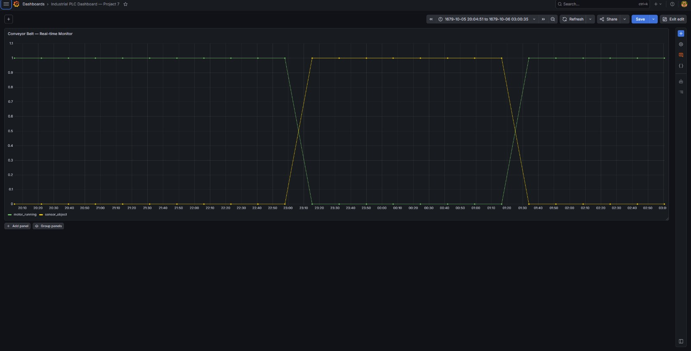
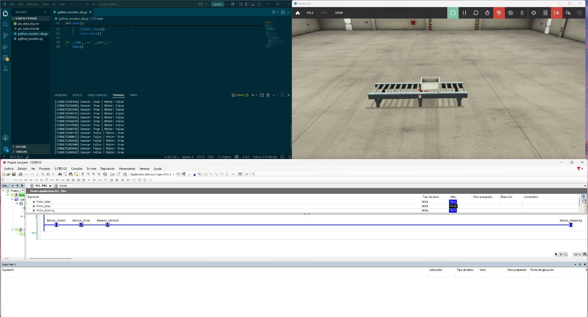

# 📊 Industrial PLC Dashboard — Project 7

Real-time industrial dashboard built with Grafana and SQLite. Visualizes live PLC signals from a CODESYS SoftPLC connected to a Factory I/O 3D simulation — replicating how SCADA systems display process data in manufacturing plants.

---

## 📋 Project Overview

This project completes the Industry 4.0 data stack. A Python script reads signals from a CODESYS SoftPLC via Modbus TCP, stores them in a SQLite time-series database, and Grafana renders them as a real-time industrial dashboard — the same architecture used in real plant monitoring systems.

**Key achievement:** Full Industry 4.0 stack from PLC signal to visual dashboard, running entirely in software.

---

## 🏗️ Full Stack Architecture

```
┌─────────────────┐     Modbus TCP      ┌──────────────────┐     3D Simulation
│   CODESYS V3.5  │ ◄─────────────────► │  Factory I/O     │ ──────────────────►
│   SoftPLC SP17  │    127.0.0.1:502    │  Ultimate v2.5   │   Visual Feedback
│   Ladder Logic  │                     │  Scene: A to B   │
└────────┬────────┘                     └──────────────────┘
         │ Modbus TCP
         ▼
┌─────────────────┐
│  Python Script  │ ──► plc_industrial.db (SQLite)
│  pymodbus 3.x   │              │
└─────────────────┘              ▼
                        ┌─────────────────┐
                        │    Grafana      │
                        │   Dashboard     │
                        │  localhost:3000 │
                        └─────────────────┘
```

---

## 📊 Dashboard Panels

| Panel | Type | Signal | Description |
|---|---|---|---|
| Conveyor Belt Monitor | Time series | motor_running + sensor_object | Historical view of motor and sensor states |

### Signal behavior visible in dashboard

- **motor_running = 1** → Conveyor belt active
- **motor_running = 0** → Belt stopped (sensor triggered)
- **sensor_object = 1** → Object detected at sensor position
- **sensor_object = 0** → No object detected

---

## 🗄️ Database Schema

```sql
CREATE TABLE plc_data (
    id INTEGER PRIMARY KEY AUTOINCREMENT,
    timestamp INTEGER NOT NULL,
    sensor_object INTEGER NOT NULL,
    motor_running INTEGER NOT NULL
)
```

Timestamps stored as Unix milliseconds for native Grafana time series compatibility.

---

## 🔍 Grafana Query

```sql
SELECT timestamp as time, motor_running, sensor_object
FROM plc_data
ORDER BY timestamp ASC
```

---

## 🛠️ Tools & Software

| Tool | Version | Purpose |
|---|---|---|
| CODESYS Development System | V3.5 SP17 | PLC programming (Ladder) |
| CODESYS Control Win V3 x64 | 3.5.17.0 | SoftPLC runtime |
| Factory I/O | Ultimate v2.5.10 | 3D industrial simulation |
| Python | 3.14.5 | Data acquisition + DB writer |
| pymodbus | 3.13.0 | Modbus TCP client |
| SQLite | 3.50.4 | Time-series data storage |
| Grafana | 13.0.1 | Industrial dashboard |

---

## ▶️ How to Run

1. Start **CODESYS Control Win V3 x64** → Start PLC
2. Open CODESYS project → Login → Run (F5)
3. Open Factory I/O → Scene "1 - From A to B" → Connect Modbus TCP → Play
4. Run the Python script:

```bash
python python_monitor_db.py
```

5. Open Grafana at **http://localhost:3000**
6. Open dashboard **"Industrial PLC Dashboard — Project 7"**
7. Set auto-refresh to **10s** for near real-time updates

---

## 📸 Screenshots

**Grafana dashboard — real-time conveyor belt signals**


**Full stack running — CODESYS + Factory I/O + Python + Grafana**


---

## 🐛 Known Limitations

### SQLite concurrent access
SQLite has file-level locking — Grafana and Python cannot read/write simultaneously without occasional conflicts. The script includes a 100ms delay after each commit to minimize lock contention.

**Production solution:** Replace SQLite with InfluxDB or TimescaleDB for true concurrent time-series storage — planned for Project 8.

---

## 🗺️ Roadmap Context

This project is **Part 7** of an Industry 4.0 Engineer learning path:

- ✅ Projects 1–4 — PLC fundamentals (TIA Portal, S7-1500)
- ✅ Project 5 — Conveyor Belt Sensor Control (CODESYS + Modbus TCP + Factory I/O)
- ✅ Project 6 — PLC Python Modbus Monitor (Real-time data acquisition to CSV)
- ✅ **Project 7 — Industrial PLC Dashboard (Python + SQLite + Grafana)**
- 🔜 Project 8 — InfluxDB migration for true concurrent time-series storage

---

## 👩‍💻 Author

**Alexis Medrano** — Control & Automation Engineer | Industry 4.0  
[github.com/AlexisMMMM](https://github.com/AlexisMMMM)
